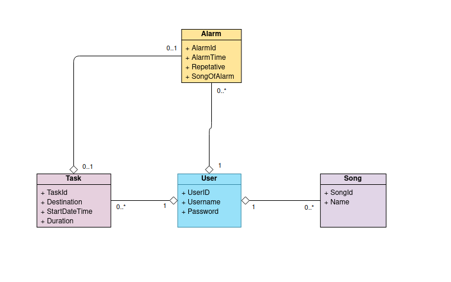
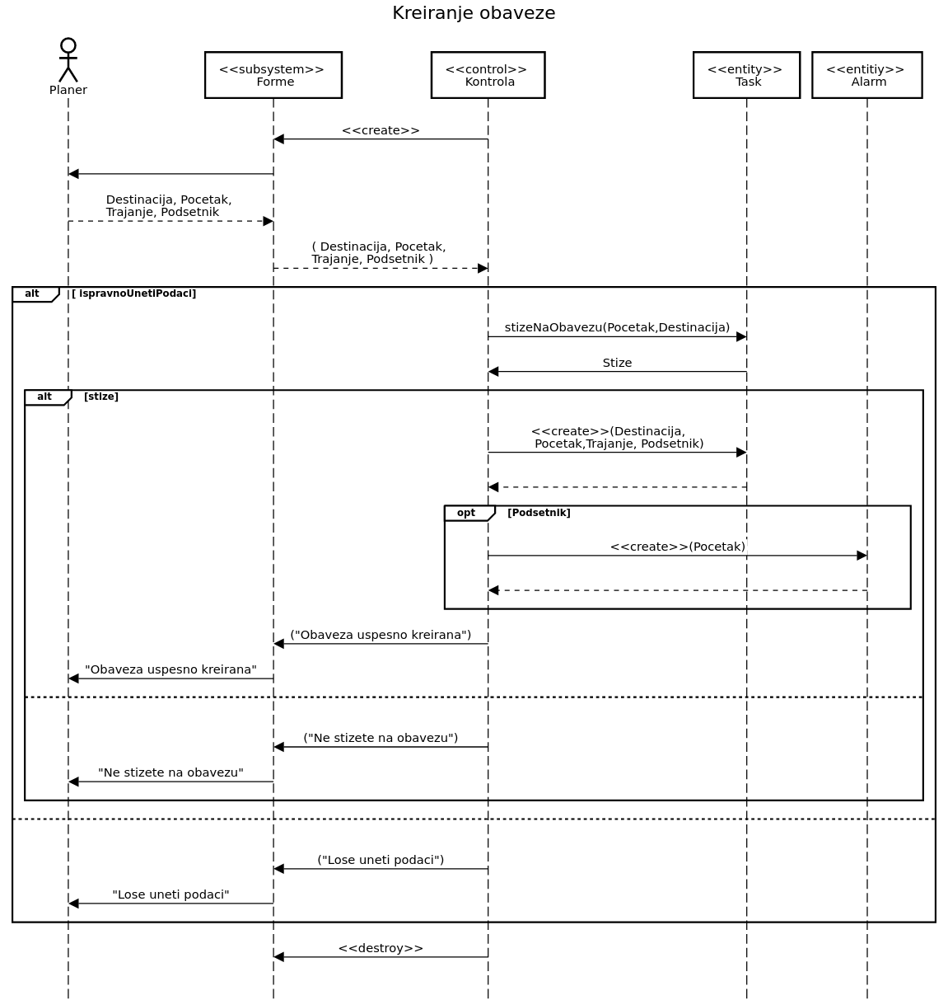

# Smart-Home-System
Simulation of system for smart home - Project for Information Systems Course (School of Electrical Engineering 2021)

Technologies used:
* Java 8
* JMS (Java Message Service)
* JPA (Java Persistence API)
* MySQL

Class diagram:

Sequence diagram:

